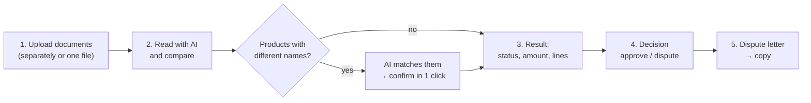
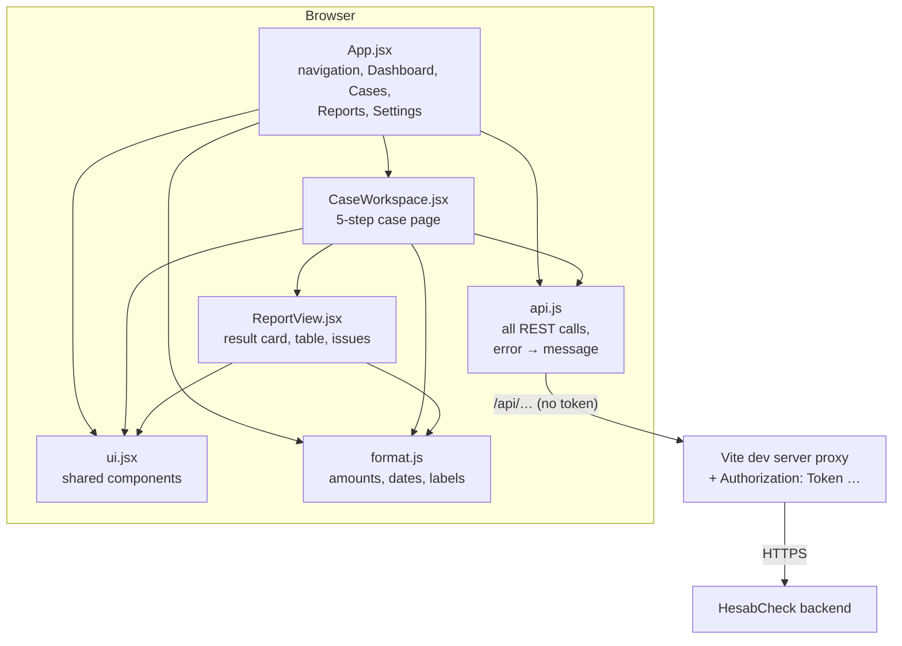

# HesabCheck — Frontend

**A web interface where you upload a purchase order, a goods receipt and an invoice, and in a few clicks get an evidence-backed answer to “how much were we about to overpay?”.**

> The accountant doesn't fill in spreadsheets or open a calculator: they upload the documents, press **“AI ilə oxu və müqayisə et”** (“Read with AI and compare”) and a few seconds later see **“Uyğunsuzluq — 240,00 AZN”** (“Mismatch — 240.00 AZN”), which product the difference is in, and a ready dispute letter for the supplier.

| | |
|---|---|
| **Live demo** | https://hesabcheckfrontend.testgrelo.online |
| **Backend** | Django REST API — separate repository (`hackaton`), live: https://hesabcheck.testgrelo.online/api/docs/ |
| **Stack** | React 19 · Vite 8 · Vitest · Testing Library |
| **Tests** | 111 tests, ~98% line coverage |
| **Language** | The interface and all messages are in Azerbaijani |
| **Status** | Demo version (hackathon MVP) — see [Data protection and encryption](#9-data-protection-and-encryption) |

---

## Table of contents

1. [The problem](#1-the-problem)
2. [The solution: what the interface does](#2-the-solution-what-the-interface-does)
3. [User journey — step by step](#3-user-journey--step-by-step)
4. [The final answer: what appears on screen](#4-the-final-answer-what-appears-on-screen)
5. [How it makes the user's life easier](#5-how-it-makes-the-users-life-easier)
6. [Pages](#6-pages)
7. [Technical design](#7-technical-design)
8. [Backend connection and why there is no login screen](#8-backend-connection-and-why-there-is-no-login-screen)
9. [Data protection and encryption](#9-data-protection-and-encryption)
10. [API ↔ UI map](#10-api--ui-map)
11. [Installation and running](#11-installation-and-running)
12. [Sample documents for testing](#12-sample-documents-for-testing)
13. [Tests](#13-tests)
14. [Limitations](#14-limitations)
15. [Project structure](#15-project-structure)

---

## 1. The problem

Every purchase has three documents: a **purchase order** (what we asked for), a **goods receipt** (what arrived) and an **invoice** (what we must pay). Before an invoice is paid, these three must be compared line by line — this is called **three-way matching**.

For an accountant, the job looks like this:

- Three documents in three formats: one in Excel, one a phone photo, one the supplier's PDF.
- The same product named differently in each: “A4 kağız 80 q/m²”, “Бумага офисная A4”, “Office A4 80”.
- Dozens of lines with small differences: two boxes missing here, a price 0.05 AZN higher there.
- Once a difference is found — calculator, Excel, then a letter to the supplier with screenshots as evidence.

The result: hours of work, a risk of mistakes and overpayments that are never caught.

---

## 2. The solution: what the interface does

The HesabCheck interface lets the user do the whole job **on one page, in 5 consecutive steps**. The heavy lifting — reading documents, recognising products, calculating — is done by the system; the user reviews the result and decides.



**Principle:** the AI reads and suggests, the system calculates money precisely, **the human makes the final decision**. No AI suggestion affects the result without the user's confirmation.

---

## 3. User journey — step by step

> Button and label names below are the actual Azerbaijani texts in the interface, with an English translation.

### Step 0 — Create a case
On the **Yoxlamalar** (Cases) page, enter a title (e.g. “Ofis kağızı alışı – oktyabr”) and a supplier name → **“Yarat və aç”** (Create and open). The case page opens immediately.

### Step 1 — Documents
Three cards: **Satınalma sifarişi** (Purchase order), **Qəbul sənədi** (Goods receipt), **Faktura** (Invoice). There are three ways to bring documents in:

| Way | When | How |
|---|---|---|
| **One file per card** | The most common case | “Fayl seç” (Choose file) on the card |
| **Combined file** | All documents are in one scanned PDF | “Birləşmiş faylı yüklə” (Upload combined file) above the cards — the AI finds the documents and places them into the cards |
| **Manual entry** | Paper document or correcting an AI mistake | “Manual daxil et / Məlumatı düzəlt” (Enter manually / Correct data) — JSON editor with “Nümunə yüklə” (Load sample) and “Boş şablon” (Empty template), mandatory correction note |

Accepted formats: **PDF, scans, phone photos (JPG, PNG, HEIC, WEBP), Word, Excel, CSV, TXT**, up to 10 MB. Oversized files are rejected immediately, without being sent to the server.

Each card shows the document status (Not uploaded / Uploaded / Read by AI / Extraction failed / Manual), the file name, a **“Endir”** (Download) button, the product table read by the AI, VAT, notes printed on the document, warnings and AI usage (model, tokens, seconds). For documents that came from a combined file, the source pages are shown.

For an AI-free trial, **“Demo məlumatla doldur”** (Fill with demo data) fills all three cards in one click.

### Step 2 — Read with AI and compare
**“AI ilə oxu və müqayisə et”** — one button that:
1. Reads the uploaded files (1, 2 or 3) with AI.
2. Runs the comparison **automatically** if the required documents are ready.
3. Fetches AI matching suggestions **automatically** if products with different names and no codes remain.

If only one document has been read, the system says what is missing: *“Müqayisə üçün hələ lazımdır: Faktura”* (Still needed for comparison: Invoice). Without a goods receipt, an order ↔ invoice comparison is run and this is stated clearly.

An **AI matching suggestion** looks like this:

> ☑ **Sifariş:** 1. A4 kağız 80 q/m² (100) ↔ **Qəbul:** 1. A4 paper 80gsm (80) ↔ **Faktura:** 1. Office A4 80 (100)
> Same product: A4 kağız 80 q/m², A4 paper 80gsm and Office A4 80 describe the same item. · Confidence: 95%
>
> **[Təsdiqlə və müqayisə et]** (Confirm and compare) [Əl ilə düzəlişə köçür] (Move to manual editing)

Unticking a wrong suggestion is enough. While confirmation is pending, a yellow **“AI uyğunlaşdırması təsdiq gözləyir”** (AI matching awaits confirmation) banner with a one-click confirm button appears above the report — so the user never mistakes the intermediate result for the final one.

When needed, the **manual mapping editor** lets the user pick from drop-downs which order line matches which receipt and invoice line (“Cari hesabatdan götür” — take from current report, “+ Sətir əlavə et” — add row, “Sil” — delete).

### Step 3 — Result
A large result card (status and amount), a line-by-line table and a list of points requiring review. Details: [The final answer](#4-the-final-answer-what-appears-on-screen).

### Step 4 — Human decision
**Təsdiqlə / Etiraz et / Əlavə yoxlama** (Approve / Dispute / Further review) with a mandatory note. “Approve” is enabled only when the result is “Matched” — a mismatched invoice cannot be approved by mistake. The decision is shown on the card.

### Step 5 — Dispute letter
**“Qaralama yarat”** (Create draft) → a ready letter to the supplier in Azerbaijani: subject, product, order/receipt/invoice figures, disputed amount. **“Kopyala”** (Copy) to paste it into an e-mail. The button is disabled when the result is “Matched”.

### History
At the bottom of the page, every event, newest first: created, uploaded, AI extraction, combined file split, correction, comparison, decision, letter — each with its time and an expandable “Detallar” (Details) section.

---

## 4. The final answer: what appears on screen

A real example — three PDFs, no product codes, different names, 20 units missing on the receipt:

```text
┌─────────────────────────────────────────────────────────────┐
│ NƏTİCƏ · ÜÇTƏRƏFLİ · REVISION 6                             │
│ Uyğunsuzluq                          ┌────────────────────┐ │
│ Sənədlər arasında fərq tapıldı.      │ Mübahisəli məbləğ  │ │
│                                      │ 240,00 AZN         │ │
│                                      └────────────────────┘ │
└─────────────────────────────────────────────────────────────┘

 Məhsul                      Sifariş  Qəbul  Faktura  Qiymət          Fərq        Status
 A4 kağız 80 q/m²            100      80     100      12,00 / 12,00   240,00 AZN  Uyğunsuzluq
   Sifariş, qəbul və faktura miqdarları fərqlidir.
 Printer toner HP 59A        12       12     12       89,00 / 89,00   0,00 AZN    Uyğundur
```

*(Result · three-way · Mismatch · Disputed amount; columns: Product, Ordered, Received, Invoiced, Price, Difference, Status.)*

| Status | Colour | Meaning |
|---|---|---|
| **Uyğundur** (Matched) | green | Everything matches — the payment can be approved |
| **Uyğunsuzluq** (Mismatch) | red | A difference was found, the amount is calculated precisely |
| **İnsan yoxlaması** (Human review) | yellow | Data is incomplete or risky (VAT, different currency, unreadable field) — reasons are listed under “Yoxlama tələb edən məqamlar” (Points requiring review) |
| **Qaralama** (Draft) | blue | Not compared yet |

If the amount is based on incomplete data, the card says so explicitly: *“Məbləğ natamam məlumata əsaslanır; yekun rəqəm kimi istifadə etməyin.”* (The amount is based on incomplete data; do not use it as a final figure.)

On the **Hesabatlar** (Reports) page, each case's report, decision and note are in one place; **“JSON endir”** (Download JSON) exports a file for archiving or for an accounting system.

---

## 5. How it makes the user's life easier

| Concern | How the interface solves it |
|---|---|
| “Which file goes where?” | Three clear cards — or upload everything as one file and let the AI split it |
| “Is this format supported?” | PDF, scan, phone photo, Word, Excel, CSV — all with the same button |
| “How many buttons do I need?” | One: reading, comparison and AI suggestions run in sequence, automatically |
| “Did the AI recognise the same product?” | Each suggestion shows its reason and confidence; a wrong one is removed with one click |
| “Is this result final?” | Pending AI matching is flagged with a yellow banner, an incomplete amount with an explicit warning |
| “What went wrong?” | Every error is specific and in Azerbaijani: *“Faktura oxunmadı”* (Invoice was not read), *“Maksimum fayl ölçüsü 10 MB-dır”* (Maximum file size is 10 MB), *“Fayl: Etibarlı fayl yükləyin”* (File: upload a valid file) |
| “The AI misread something” | “Məlumatı düzəlt” (Correct data) fixes that document; the correction stays in the history |
| “The receipt hasn't arrived yet” | Order ↔ invoice comparison runs right away, with a warning |
| “Could I approve a mismatched invoice by mistake?” | No — “Approve” is enabled only for a matched result |
| “What do I write to the supplier?” | A ready letter, copied in one click |
| “Someone else changed the case meanwhile” | The system detects it, reloads the data and asks to try again |
| “Login, passwords, sessions…” | The local version has no login screen — the system opens directly |

---

## 6. Pages

| Page | Content |
|---|---|
| **Dashboard** | Total disputed amount of recent cases (per currency), counts of mismatched / needing review / matched, new case form, the 6 latest cases |
| **Yoxlamalar** (Cases) | All cases (pages of 25), status and amount badges, create form, **“Sil”** (Delete, with confirmation) |
| **Yoxlama** (Case) | The 5-step work page described above, “Yenilə” (Refresh) and “Yoxlamanı sil” (Delete case) |
| **Hesabatlar** (Reports) | Reports of compared cases, decision and note, “JSON endir”, “Yoxlamanı aç” (Open case) |
| **Ayarlar** (Settings) | Backend rules: accepted formats, size limit, number of documents, approval rule |

The interface is responsive: cards and tables stack vertically on narrow screens.

---

## 7. Technical design



| File | Responsibility |
|---|---|
| `src/api.js` | One function per Swagger endpoint; JSON and multipart requests; turns DRF errors (`detail`, field errors, nested errors, lists) into readable Azerbaijani messages; file download |
| `src/App.jsx` | Navigation, list and pagination, create/delete, Dashboard statistics, Reports, Settings |
| `src/components/CaseWorkspace.jsx` | Document cards, upload, combined file, JSON editor, AI read → compare → suggestion chain, mapping editor, decision, letter, history |
| `src/components/ReportView.jsx` | Result card, line table (including two-way mode), issue labels |
| `src/components/ui.jsx` | `PageHeader`, `SectionHeading`, `Notice`, `Pill`, `Badge`, `Field`, `EmptyState` |
| `src/format.js` | Amounts (`240,00 AZN`), dates (`09.10.2026 13:46`, independent of browser locale), status/event/issue labels, empty document template |
| `src/demo/*.json` | Synthetic data for “Fill with demo data” and “Load sample” (240 AZN difference) |

### Design principles

- **The server is the source of truth.** After every action the case object returned by the backend is rendered — the interface never computes statuses or amounts itself.
- **Every action follows the same flow:** buttons are disabled, labels change to “Oxunur…” (Reading…), “Müqayisə edilir…” (Comparing…), the result is shown as a notice at the top of the page, and the history is refreshed.
- **Revision conflicts (409)** are handled automatically: data is reloaded from the server and the user is asked to try again.
- **Long AI requests:** the proxy timeout is 11 minutes.

---

## 8. Backend connection and why there is no login screen

The local version has **no login or sign-up screen** — `npm run dev` opens the system directly.

The backend is still protected and requires a token. The Vite dev server takes care of it ([vite.config.js](vite.config.js)):

1. On start-up it obtains a token from `/api/auth/token/` using `HESABCHECK_USERNAME` / `HESABCHECK_PASSWORD` from `.env` (or uses a ready `HESABCHECK_TOKEN`).
2. It forwards every `/api/...` request from the browser to the backend and adds `Authorization: Token …`.
3. For the browser, requests go to the same origin — **no CORS issues**.

**Security:** variables without the `VITE_` prefix are never bundled into browser code, and `.env` is not committed — the username, password and token stay in the dev server only. This was verified on a production build. If the account is wrong, the interface explains what to do: *“Backend girişi alınmadı. hackhaton/.env faylında HESABCHECK_USERNAME və HESABCHECK_PASSWORD … yazın”* (Backend login failed. Set HESABCHECK_USERNAME and HESABCHECK_PASSWORD in hackhaton/.env).

---

## 9. Data protection and encryption

> **This is a demo version.** For the hackathon we deliberately did **not** add background encryption of uploaded files. The encryption system is designed and is being prepared for the production release; the details are in the backend README (“Data protection and encryption”).

What already applies today:

- **In transit:** the browser talks to the local Vite server, which forwards requests to the backend over **HTTPS**; the backend talks to Gemini over HTTPS.
- **No secrets in the browser:** the backend account and token stay in the dev server; the browser never stores a token, password or session.
- **No public file links:** files are downloaded only through the authenticated backend endpoint.

What is being prepared (backend side, invisible to the user): **AES-256-GCM encryption of stored files**, field-level encryption of sensitive data, encrypted off-server backups, automatic deletion of original files after a retention period, and separate key management. The interface will not change — uploading, AI reading and downloading work exactly the same, encryption happens in the background.

---

## 10. API ↔ UI map

| Endpoint | In the interface |
|---|---|
| `POST /api/auth/token/` | Not used by the browser — the Vite dev server obtains the token with the `.env` account |
| `GET /api/cases/` | Dashboard and Cases list (with pagination) |
| `POST /api/cases/` | “Yoxlama yarat” (Create case) form |
| `GET /api/cases/{id}/` | Case page, “Yenilə” (Refresh) |
| `DELETE /api/cases/{id}/` | “Sil” in the list and “Yoxlamanı sil” on the case page (with confirmation) |
| `POST /api/cases/{id}/documents/` | “Fayl seç” / “Faylı əvəzlə” (Choose / Replace file) on a document card |
| `POST /api/cases/{id}/bundle/` | “Birləşmiş faylı yüklə” (Upload combined file) |
| `GET /api/cases/{id}/documents/{document_id}/download/` | “Endir” (Download) on a card |
| `POST /api/cases/{id}/document-data/` | JSON editor, “Demo məlumatla doldur” |
| `POST /api/cases/{id}/extract/` | “AI ilə oxu və müqayisə et” |
| `POST /api/cases/{id}/compare/` | Automatic (`{}`) after reading and via “Müqayisə et” (Compare); manual (`revision` + `mappings`) via “Təsdiqlə və müqayisə et” and the mapping editor |
| `POST /api/cases/{id}/suggestions/` | Automatically when unmatched lines remain; “Təklif al” (Get suggestions) |
| `POST /api/cases/{id}/review/` | “İnsan qərarı” (Human decision) form |
| `GET /api/cases/{id}/report/` | Reports page, “JSON endir” |
| `POST /api/cases/{id}/dispute-letter/` | “Qaralama yarat” |
| `GET /api/cases/{id}/history/` | History |

---

## 11. Installation and running

Requirement: Node.js 20+.

```bash
npm install
cp .env.example .env      # set HESABCHECK_USERNAME and HESABCHECK_PASSWORD
npm run dev
```

Open http://localhost:5173 — the system opens directly.

### `.env`

| Variable | Default | Description |
|---|---|---|
| `VITE_API_TARGET` | `https://hesabcheck.testgrelo.online` | Backend the proxy forwards to. For a local Django: `http://127.0.0.1:8000` |
| `HESABCHECK_USERNAME` | — | Backend user (stays in the dev server only) |
| `HESABCHECK_PASSWORD` | — | Backend password (stays in the dev server only) |
| `HESABCHECK_TOKEN` | — | Alternative: a ready token; if set, username/password are not used |
| `VITE_API_BASE_URL` | empty | Keep empty — requests go through the proxy |

Restart `npm run dev` after changing `.env`.

### Production

Live at **https://hesabcheckfrontend.testgrelo.online**. Every push to `main` runs CI (lint, tests, build, Docker image); the server deploys the newest successful commit automatically within ~2 minutes. In production the frontend's nginx container plays the role of the Vite proxy and adds the backend token server-side. Details: [deploy/README.md](deploy/README.md).

### Scripts

| Command | What it does |
|---|---|
| `npm run dev` | Development server (with proxy and automatic backend login) |
| `npm run build` | Production build (`dist/`) |
| `npm run preview` | Preview the build locally (same proxy) |
| `npm run lint` | ESLint |
| `npm test` | All tests |
| `npm run test:watch` | Tests in watch mode |
| `npm run coverage` | Coverage report (`coverage/index.html`) |

---

## 12. Sample documents for testing

The `test-files/` folder contains synthetic documents for trying the system by hand (companies and numbers are fictional):

| File(s) | What it tests | Expected result |
|---|---|---|
| `sifaris.txt` (AZ), `qebul-akti.txt` (RU), `faktura.txt` (EN) | Three languages, different names, different units (`qutu`/`кор.`/`box`) | **122.00 AZN**: 8 boxes of paper missing (112) + pens invoiced at a higher price (10) |
| `birlesmis-sened.pdf` | Three documents in one 3-page PDF → “Birləşmiş faylı yüklə” | **122.00 AZN**, documents from pages 1/2/3 |
| Only `sifaris.txt` + `faktura.txt` | Without a goods receipt | **10.00 AZN** (only the price difference is visible) |
| `boyuk-sifaris.docx`, `boyuk-qebul-akti.pdf`, `boyuk-faktura.xlsx` | Word + 4-page PDF (repeated headers, page subtotals) + Excel, 60 lines each | **274.74 AZN**: 4 of 60 lines mismatched |

Without an AI key: **“Demo məlumatla doldur”** → **“Müqayisə et”** → **240.00 AZN**.

---

## 13. Tests

```bash
npm test            # 111 tests, ~3 seconds
npm run coverage    # coverage report
```

The tests use [Vitest](https://vitest.dev) and [Testing Library](https://testing-library.com) and check the interface **the way the user sees it**: button names, labels, on-screen text, clicks and file selection. The backend is never called — `src/test/mockApi.js` replaces `fetch` and lets tests verify the path, method, JSON body, file and headers of every request.

| File | Tests | What it verifies |
|---|---|---|
| `src/api.test.js` | 28 | Method, path and body of every endpoint; the browser sends no token; multipart; 8 shapes of DRF errors turned into messages; 401 explanation; network error; history formats; file name from `Content-Disposition` |
| `src/format.test.js` | 10 | Amount and date formatting, statuses, labels exist for every backend code, empty document template matches the backend schema |
| `src/components/ReportView.test.jsx` | 13 | Result card (4 statuses), incomplete-amount warning, two-way mode, line table, issue labels and locations, UI components |
| `src/App.test.jsx` | 22 | Opening without login, 401 explanation, Dashboard statistics, case creation and errors, opening and going back, pagination, delete with confirmation, Reports (loading, JSON download, selection, error), navigation |
| `src/components/CaseWorkspace.test.jsx` | 38 | Document card states, upload and limits, download, JSON editor, demo fill, AI read → automatic comparison, partial reading, failed document, 503 and 409, AI suggestions (automatic fetch, banner, selection, two-way, error), manual mapping, combined file, decision rules, letter and copy, history |

Helpers:
- `src/test/mockApi.js` — `mockApi(routes)` fake backend, `reply(status, body)` for status codes, `sequence(a, b)` for successive responses.
- `src/test/fixtures.js` — sample responses matching the Swagger schema: `makeCase`, `readyCase`, `mismatchReport`, `twoWayReport`, `unmatchedReport`, etc.

---

## 14. Limitations

- **Demo version without file encryption at rest** — see [Data protection and encryption](#9-data-protection-and-encryption).
- **No login screen — also on the public demo.** Locally the Vite proxy, in production the nginx container adds the backend token. Anyone who opens the demo URL works as the demo user (API calls are rate-limited). Use synthetic documents only; real company data needs authentication in front of the site.
- **Files are selected by clicking** — drag & drop is not implemented yet.
- **AI accuracy** depends on the backend and has not been measured on real company documents; that is why the interface keeps the source of every number and the ability to correct it.
- **Invoices with VAT** currently result in “Human review” (a backend limitation).

---

## 15. Project structure

```text
hackhaton/
├── src/
│   ├── App.jsx                     # Navigation and pages
│   ├── api.js                      # REST API client
│   ├── format.js                   # Formatting and labels
│   ├── components/
│   │   ├── CaseWorkspace.jsx       # Case page (5 steps)
│   │   ├── ReportView.jsx          # Result, table, issues
│   │   └── ui.jsx                  # Shared components
│   ├── demo/                       # Demo document data
│   ├── test/                       # mockApi, fixtures, setup
│   ├── *.test.js(x)                # Tests (next to the components)
│   ├── App.css, index.css          # Styles
│   └── main.jsx
├── test-files/                     # Documents for manual testing
├── deploy/                         # nginx templates, compose, pull-based deploy script, systemd timer
├── .github/workflows/ci.yml        # CI: lint, tests, build, Docker image
├── Dockerfile                      # Build + nginx runtime image
├── vite.config.js                  # Proxy + automatic backend login + test settings
├── .env.example                    # Environment variables example
└── package.json
```
